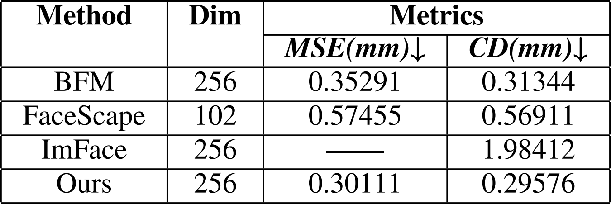
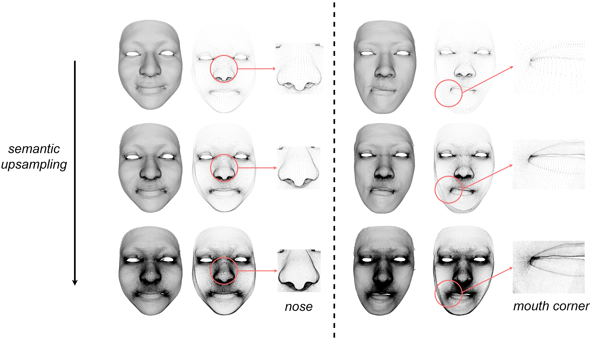

# 3D Morphable Face Model with Continuous Semantics (cm-3dmm)

## 项目简介
本项目是论文 "3D Morphable Face Model with Continuous Semantics" 的官方实现。

我们提出了一种**具有连续语义的人脸几何模型**。（"语义"指的是人脸表面不同区域间的相对位置关系属性）。模型通过隐式神经场（Implicit Neural Fields）实现，并将面部语义通过UV坐标进行参数化表示。

本项目基于 [FaceScape](https://github.com/zhuhao-nju/facescape) V1.3完成UV参数化展开策略、数据集构建。


### pipeline
基于隐式神经场，将连续语义空间的UV坐标映射至几何空间。
<p align="center">

</p>

### 几何重建实验
与其他常见模型的几何重建精度对比，达到最好。
<p align="center">

</p>

### 语义上采样实验
逐渐提高语义空间（UV空间）采样密度，几何符合人脸特征、逐渐趋于连续。
<p align="center">

</p>

## 环境设置

为了运行本项目中的代码，建议使用 `conda` 创建一个独立的 Python 虚拟环境，并安装所需的依赖包。

```bash
conda create -n cm_3dmm python=3.8  # 您可以根据需要选择 Python 版本
conda activate cm_3dmm

# 安装依赖
cd cm_3dmm
pip install -r requirements.txt
```

## 大文件下载与准备

本项目的部分关键数据，如预训练模型参数和预定义模型数据，由于体积较大，未直接包含在 GitHub 仓库中。请按照以下指引下载并配置这些文件：

### 1. 预定义模型参数 (`predefined_model_data`)

此数据包含模型运行所需的基础参数，如人脸拓扑的UV参数化展开策略等。

*   **基础版**:
    *   下载链接: [`predefined_model_data.zip`](https://drive.google.com/file/d/1UVLFCwMb1DuzahQM7N1Zdqz_JdOVs-9A/view?usp=sharing)
    *   操作: 下载后解压缩，并将解压得到的 `predefined_model_data` 文件夹放置在项目根目录 (`./`) 下。

*   **完整版 (可选)**:
    *   下载链接: [`predefined_model_data_full.zip`](https://drive.google.com/file/d/1LtOn7myqAwv4JNnttvzT_YUWhHvS59YO/view?usp=drive_link)
    *   操作: 下载后解压缩，将解压得到的文件夹重命名为 `predefined_model_data`，然后将其放置在项目根目录 (`./`) 下 。
    *   说明：此版本包含更全面的预定义模型参数，例如不同分辨率下的拓扑模板信息。

### 2. 预训练模型检查点 (`ckpt` 文件)

*   下载链接: [预训练模型参数](https://drive.google.com/file/d/170XwMnFHaYupLElHCZtYVbDTdXW3Mh-h/view?usp=drive_link)
*   操作: 下载模型参数文件，并将其放置在项目根目录下的 `./experiment` 文件夹内。

### 3. 测试数据 (可选)

*   下载链接: [人脸几何测试数据](https://drive.google.com/file/d/1_3JsWNfugkX_iF1L81vBw0hoFrN8b7FR/view?usp=sharing)
*   操作: 下载数据后，您需要将 `fitting.py` 脚本中指定的测试数据路径修改为指向您存放这些数据的位置。
*   说明: 此压缩包提供了若干人脸几何样本，可用于测试模型的拟合与重建效果。

请确保以上文件均已正确下载并放置到指定位置，以便项目脚本能够顺利运行。


## 使用说明
- `fitting.py`: 基于模型完成目标人脸的拟合重建。
  ```bash
  python fitting.py
  ```
  
- `train.py`: 模型的训练脚本。
  ```bash
  python train.py
  ```


